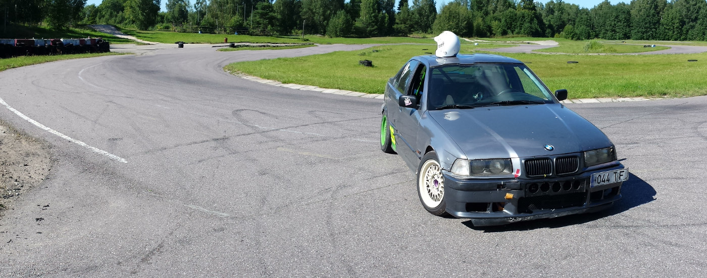
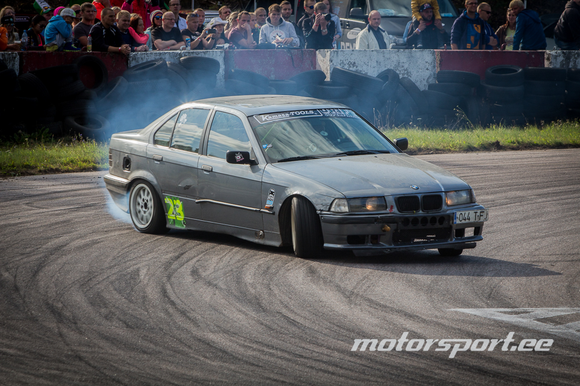
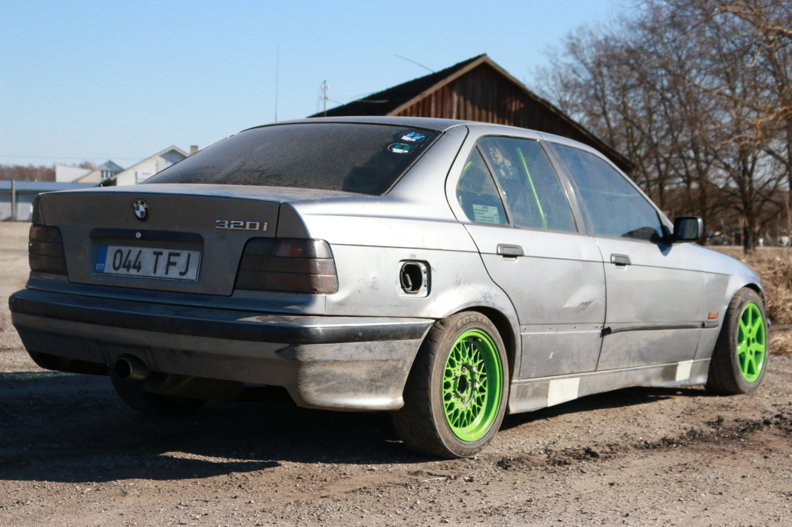

## Istu ehtsa driftiauto rooli ja rebi täiel kiirusel külg ees asfaltit

# Misasja?

Oled mõelnud, et tahaks proovida võimsa autoga sõita? Tule proovi järgi! Elamussõit OÜ pakub võimalust ise driftiauto rooli keerata ja rehve põletada.

# Autost

- BMW E36
- 2,5 R6 turbomootor
- 230kw/403NM
- Kiirendus 0-100km/h 5 sek
- Turvakaar
- 6 punkti vööd koos korvistmega

# Instruktor

- Margus Mangus
- Osalenud 3 aastat Eesti Meistrivõistlustel Driftis
- 2015 aasta 2. etapi võitja Pro-street klassis

# Korduma Kippuvad Küsimused

### Mis siis kui auto katki läheb?

Ei ole Teil mingisugust rahalist lisakulu! Elamussõit OÜ on tehtud selleks, et saaks täisgaasil sõita ilma muretsemiseta :)

# Hinnakiri

### Roolipakett

- Ise saab roolida
- 1 paar rehve kulutada
- Piisavalt kütust
- Sõit kestab orienteeruval 15-20min
- **119€**

### Kõrvalistmepakett

- 3 sõitu vingel driftirajal kõrvalistmel
- **50€**

### Gruppidele

- küsi hinnapakkumist

# Võta ühendust

- telefon +372 58 030 675
- Email margus.mangus@gmail.com

